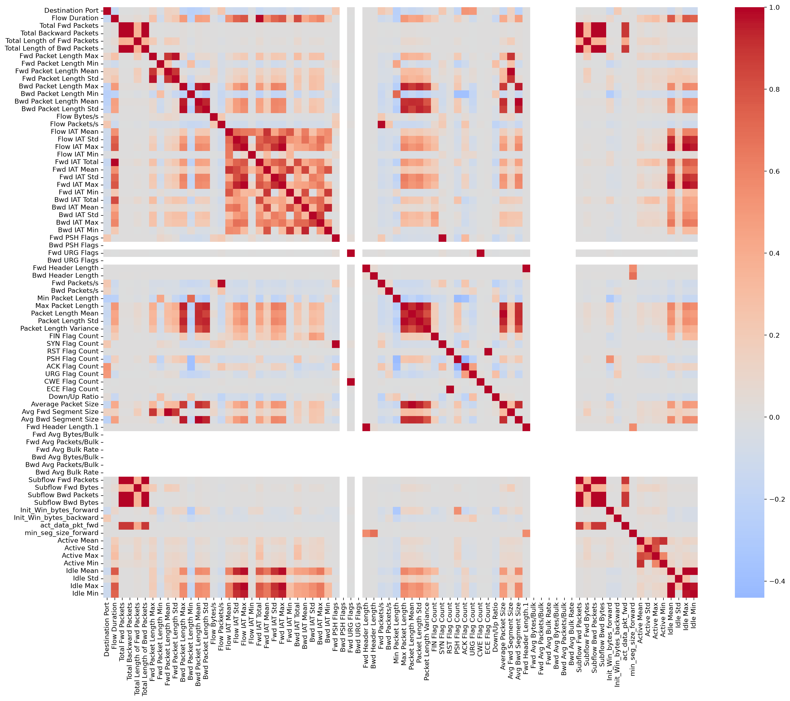
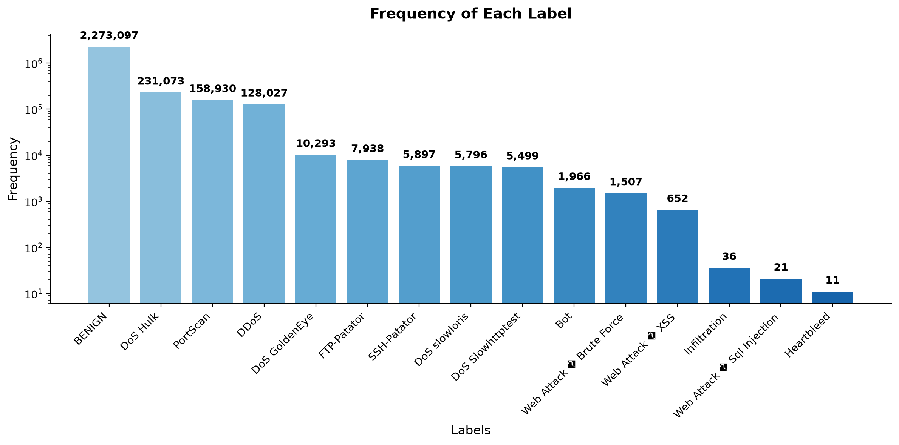
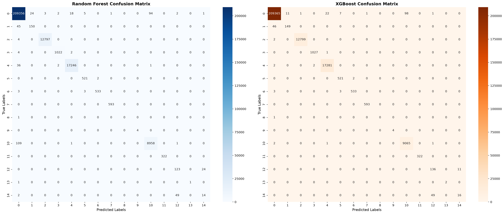

# Network Intrusion Detection with Random Forest & XGBoost
Multi-class classification of network traffic flows to detect and categorize cyberattacks (DDoS, PortScan, Brute Force, Botnet, Web Attacks, and more) using the CICIDS2017 dataset and comparing Random Forest and XGBoost on ~2.8M labeled network flow records with severe class imbalance.

## Problem
Detecting and categorizing sophisticated cyberattacks within massive volumes of normal traffic, where critical security threats are hidden inside severe class imbalances (~2.8M rows)


## Dataset
Source: [Network Intrusion dataset(CIC-IDS- 2017)](https://www.kaggle.com/datasets/chethuhn/network-intrusion-dataset/data?select=Friday-WorkingHours-Afternoon-DDos.pcap_ISCX.csv)

## Approach
1. First i imported all the required libraries and loaded the raw network traffic data.
2. During data loading, i used `read_csv` to read the huge dataset into memory.
3. Then i checked for missing values, duplicates, and general properties of the columns.
4. I used `LabelEncoder` to convert the 15 attack text categories into numbers from 0 to 14 so the models could understand them.
5. I separated the dataset into independent Train, CV, and Test CSV files in the processing phase to prevent any data leakage.
6. Inside the model scripts, i loaded these pre-split files and merged Train and CV back together to prepare them for `GridSearchCV`.
7. I used `PredefinedSplit` with a custom index mask (-1 and 0) to force `GridSearchCV` to train on the Train part and validate strictly on my actual CV file.
8. I set up hyperparameter grids for both Random Forest and XGBoost to automatically find the best tree depth and estimator counts.
9. For XGBoost, i used `device='cuda'` and `tree_method='hist'` to shift the heavy matrix math to my RTX 5070 Ti GPU, which made the 2.8M rows train in just minutes instead of hours.
10. Finally, i evaluated the best saved models on the independent Test set using Confusion Matrix, Accuracy, and F1-Macro score to see how well they handle severe class imbalance.


## Results

### Heatmap


### Frequency of Labels


### Evaluation of Results


## Key Features & Architecture
- Modular Pipeline: Structured codebase separating Data Processing, Model Training, and Evaluation.
- No Data Leakage: Implemented PredefinedSplit to strictly separate Train and Validation folds during hyperparameter tuning.
- Hardware Acceleration: Scaled XGBoost using modern device='cuda' and tree_method='hist' leveraging RTX 5070 Ti computational power.
- Rigorous Evaluation: Focused on F1-Macro scoring instead of misleading accuracy to handle extreme data imbalance.

## Performance Comparison

| Metric | Random Forest (GridSearchCV) | XGBoost (GridSearchCV + CUDA) |
| :--- | :---: | :---: |
| **Accuracy** | 0.9983 | **0.9989** |
| **F1-Score (Macro)** | 0.8317 | **0.8649** |
| **Training Speed** | ~84.5 minutes (on Ryzen 7 9700x) | **~4 minutes (on NVIDIA 5070 TI)** |

### Detailed Classification Insights
- The Winner: XGBoost outperformed Random Forest across almost all minority classes.
- Extreme Minority Handling: For Class 13 (only 2 instances in the test set), XGBoost achieved a perfect 1.00 Recall, whereas Random Forest scored 0.50.
- The Challenge (Data Imbalance): Both models faced performance drops on highly underrepresented classes like Class 14 due to extreme dataset skewness (Class 0 occupying ~85% of total traffic). 

## Tech Stack
- Languages & Frameworks: Python, Scikit-Learn, XGBoost
- Data & Viz: Pandas, NumPy, Seaborn, Matplotlib
- Infrastructure: CUDA, Joblib

## Project Structure
```text
├── data/
│   ├── raw/         # (Gitignored) Original CIC-IDS-2017 CSVs
│   └── processed/   # (Gitignored) X_train, X_cv, X_test splits
├── models/          # (Gitignored) Trained .pkl model files
├── notebooks/
│   ├── 01_eda.ipynb
│   ├── 02_preprocessing.ipynb
│   ├── 03_modeling_rf.ipynb
│   ├── 04_modeling_xgboost.ipynb
│   └── 05_evaluation_comparison.ipynb
├── results/ 
│   ├── evaluation_of_results.png
│   ├── first_heatmap.png
│   └── frequency.png
├── README.md
├── .gitignore
└── requirements.txt
```

## Setup instruction
1. Download dataset i referenced above
2. Unzip and add it to data/ folder
3. Open new terminal inside project (can be done with 'Ctrl' + 'Shift' + '`')
4. Write 'pip install -r requirements.txt'

## Progress Log
 
| Date | Commit |
|------|--------|
| 10 July | Initializing the Project |
| 10 July | EDA and PreProcessing is Done |
| 10 July | Finalized Model Training and Evaluation |
| 10 July | Finalizing Project by lastly finishing README |
| 12 July | Adding My Predictive Maintenance Anomaly Detection Project |

## Link to other repositories i have
- [My Student Pass/Fail ML Project](https://github.com/BadalovSanan/My-StudentPassFail-ML-Project)
- [Casting Product's Deffect Detecting](https://github.com/BadalovSanan/casting-defect-logistic-regression)
- [Concrete Strength Linear Regression](https://github.com/BadalovSanan/concrete-strength-linear-regression)
- [Credit Card Customer Segmentation](https://github.com/BadalovSanan/credit-card-customer-segmentation)
- [Predictive Maintenance Anomaly Detection Project](https://github.com/BadalovSanan/Predictive-Maintenance-Anomaly-Detection)
